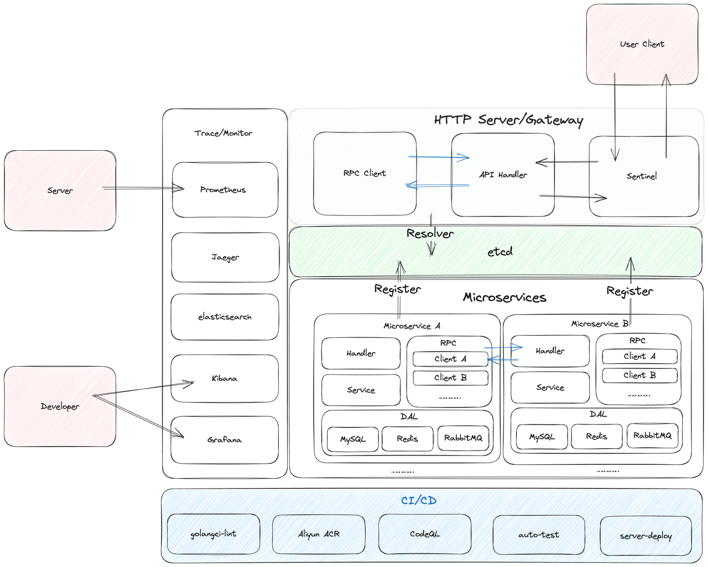
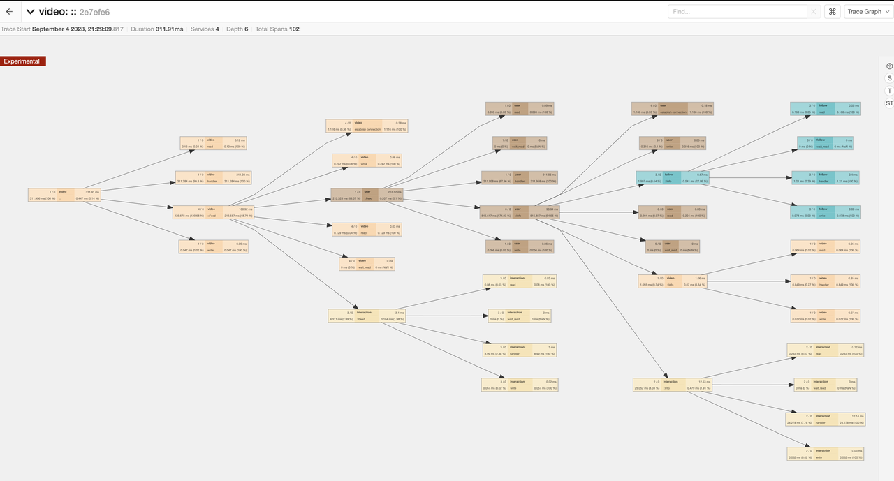
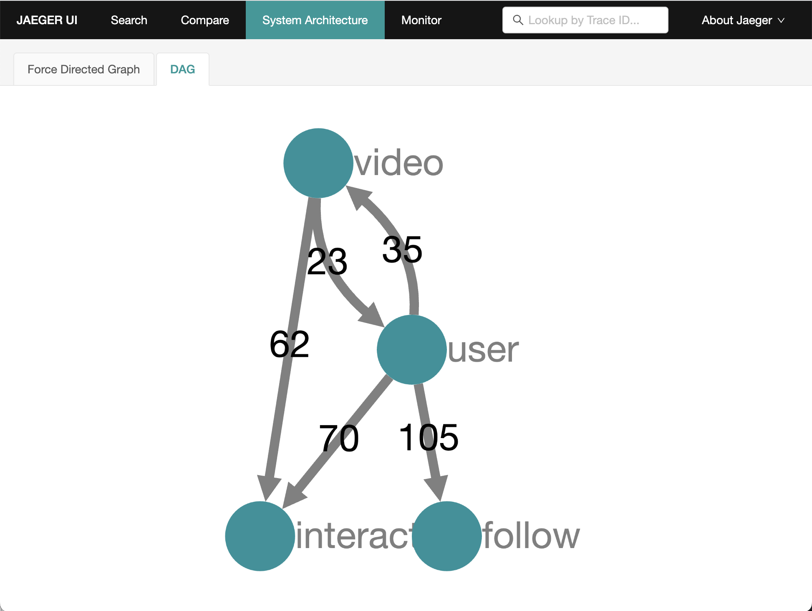

# tiktok

English | [简体中文](./docs/zh-cn.md)

**tiktok** is a distributed **simple-tiktok** backend based on RPC and HTTP protocols using Kitex + Hertz + etcd + MySQL + Jaeger + Docker + Thrift + Prometheus + Grafana + Elasticsearch + Kibana

# Feature

- Extremely easy to use and deploy.
- Relatively mature CI/CD.
- Relatively high code quality
- Safety Considerations
- Performance Optimization for Interfaces

# Architecture



# Quick start

We will introduce how to quickly start this project using Docker. If you need to build and run it locally, please refer to: [start-by-local](./docs/start-by-local.md)

Due to the script we have written, the process has been greatly simplified. You just need to use the following command to quickly start the environment and run the program in a containerized manner.

```bash
make env-up      # launch environment, env-down for remove
make docker      # build docker-image
sh docker-run.sh # launch all services

# if you just want to launch specific service, use
sh docker-run.sh api # or others
```

then you can send HTTP request on `localhost:10001` for test or others things

# Quick deploy

We use a fully automated process to streamline the workload, so you can always use our Docker image packaged with the latest code.

You can directly copy the `deploy` folder of our project to the server you expect to deploy. The folder structure is roughly as follows

```bash
deploy
├── config              # same as this projects
│   ├── config.yaml
│   ├── words.txt       # sensitive word list
│   ├── prometheus.yml
│   └── sql             # for mysql init
│       ├── init.sql
│       └── user.sql
├── docker-compose.yml  # for environment, same
└── restart-service.sh  # deploy scripts
```

The script will automatically pull the latest image from Aliyun ACR, find and delete the running containers, and re-run them with the latest image.

If you want a specific tutorial on how to use it, please visit: [deploy docs](./deploy/README.md)

# Project structure

## Overall
```bash
.
├── Dockerfile
├── LICENSE
├── Makefile              # some useful commands
├── README.md
├── cmd                   # microservices
├── config                # for run-directly config and config-example
├── deploy                # for deploy
├── docker-compose.ci.yml # for ci env
├── docker-compose.yml
├── docker-run.sh         # for local docker-run
├── docs
├── go.mod
├── go.sum
├── idl                   # interface definition
├── kitex_gen
├── pkg
│   ├── constants         # store any consts
│   ├── errno             # custom error
│   ├── middleware        # common middleware
│   ├── tracer            # for jaeger
│   └── utils             # useful funcs
└── test
```

## Gateway/api service

```bash
.
├── Makefile
├── biz
│   ├── handler     # solve request/send response
│   ├── middleware
│   ├── model
│   ├── pack        # pack response
│   ├── router      # for route
│   └── rpc         # send rpc request to microservices
├── build.sh
├── main.go
├── output          # build binary
├── router.go
├── router_gen.go
└── script
```

## Microservices
```bash
.
├── Makefile        # useful commands
├── build.sh        # build binary
├── dal
│   ├── cache       # redis
│   ├── db          # MySQL
│   └── mq          # RabbitMQ
├── handler.go
├── kitex_info.yaml
├── main.go
├── output          # build binary
├── pack            # pack response
├── rpc             # send request to other services
├── script
├── coverage        # coverage test(some service not exist)
└── service
```


# Test

you can drop `.postman/tiktok.openapi.json` to **postman** then start this project and test

# Visualization example

## Jaeger




## Kibana + Elasticsearch


## Grafana + Prometheus


# Contributor

Fuzhou University west2-online studio golang team

- [ozline](https://github.com/ozline)
- [XZ0730](https://github.com/XZ0730)
- [wushiling50](https://github.com/wushiling50)
- [jiuxia211](https://github.com/jiuxia211)
- [notacommonperson](https://github.com/notacommonperson)
- [jkskj](https://github.com/jkskj)