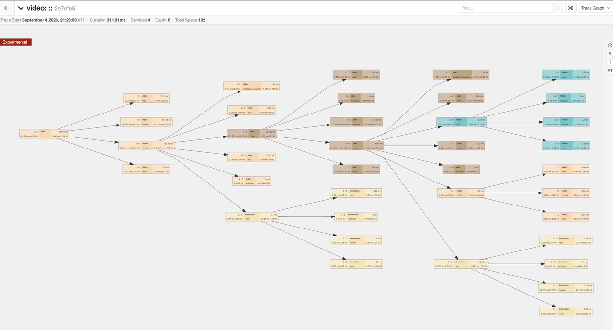
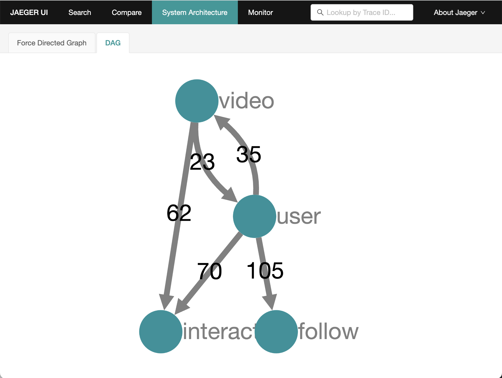
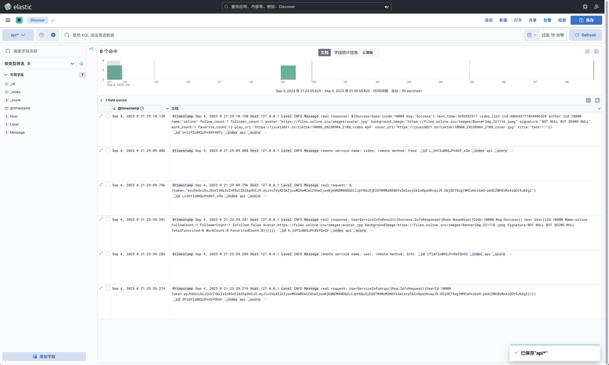
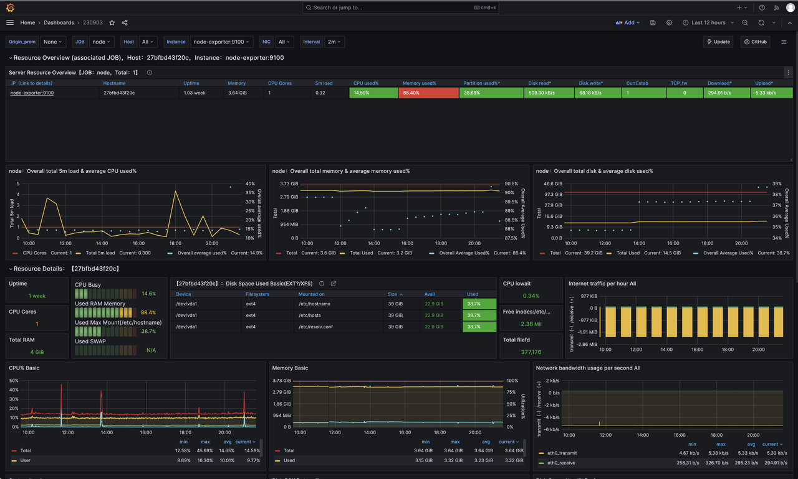

> **目前本项目不再维护，我们也已经在 2023 年 9 月封锁了这个仓库，我们在 2024 年开始开发有真实用户场景且基于这个项目进一步改良的福大助手后端([west2-online/fzuhelper-server](https://github.com/west2-online/fzuhelper-server))，如果您想参考，请访问它，它同样使用了 Hertz 和 Kitex。**

# tiktok

[English](../README.md) | 简体中文

tiktok 是一个基于HTTP和RPC协议, 分布式架构的简单抖音后端. 它使用到了 Kitex、Hertz、etcd、MySQL、Jaeger、Docker、Thrift、Prometheus、Grafana、Elasticsearch和Kibana

# 材料

这个项目来源于字节跳动青训营，我们在这里附上我们答辩的材料和回放

[答辩文档](https://west2-online.feishu.cn/docx/Bk20dtIHYoqfDCxnKw6c6eeMnih)
[答辩回放](https://www.bilibili.com/video/BV1Ep4y1P7ZT)

# 特性

- 极度容易的上手和部署
- 相对完善的持续集成/持续部署工作六
- 相对高的代码质量
- 安全性考量
- 对于接口的性能优化

# 架构


# 快速启动

我们将介绍如何使用Docker快速启动这个项目, 如果你需要本地构建并运行(Standalone), 请访问: [手动构建(英文)](./start-by-local.md)

这个项目已经通过脚本大大的简化了流程, 你只需要使用下面这些命令就可以快速拉起环境并以容器化方式运行程序

```bash
make env-up      # 拉起环境, 可以使用env-down关闭环境
make docker      # 构建docker镜像
sh docker-run.sh # 启动所有服务

# 如果你只是想启动其中一个服务, 指明即可
sh docker-run.sh api # 或者其他服务
```

之后你可以发送HTTP请求到 `localhost:10001` 来测试接口

# 快速部署

我们使用完全自动化的流程来简化工作负载, 因此您可以使用我们打包有最新代码的Docker镜像

您可以直接复制我们这个项目的`deploy`文件夹到您期望部署的服务器, 这个文件夹结构大致如下

```bash
deploy
├── config
│   ├── config.yaml     # 基础配置
│   ├── prometheus.yml  # prometheus配置
│   ├── words.txt       # 敏感词文件
│   └── sql             # mysql初始化
│       ├── init.sql
│       └── user.sql
├── docker-compose.yml  # 环境搭建
└── restart-service.sh  # 部署脚本
```

这个脚本会自动从阿里云ACR中拉取最新的镜像，查找并删除正在运行的容器，并使用最新的镜像重新运行它们。

如果您需要有关如何使用它的具体教程，请访问: [部署文档(英文)](../deploy/README.md)

# 项目结构

## 整体
```bash
.
├── Dockerfile
├── LICENSE
├── Makefile              # 一些有用的命令
├── README.md
├── cmd                   # 微服务
├── config                # 配置
├── deploy                # 部署
├── docker-compose.ci.yml # 用于持续集成环境部署
├── docker-compose.yml
├── docker-run.sh         # 用于本地启动docker容器
├── docs
├── go.mod
├── go.sum
├── idl                   # 接口定义
├── kitex_gen
├── pkg
│   ├── constants         # 存储一些常量
│   ├── errno             # 定制化错误
│   ├── middleware        # 常用的中间件
│   ├── tracer            # 链路追踪
│   └── utils             # 有用的功能
└── test
```

## 网关/API模块

```bash
.
├── Makefile
├── biz
│   ├── handler     # 请求处理、包装返回数据
│   ├── middleware
│   ├── model
│   ├── pack        # 打包
│   ├── router      # 路由
│   └── rpc         # 发送RPC请求
├── build.sh
├── main.go
├── output          # 二进制文件
├── router.go
├── router_gen.go
└── script
```

## 微服务
```bash
.
├── Makefile        # 有用的命令
├── build.sh        # 构建脚本
├── dal
│   ├── cache       # redis
│   ├── db          # MySQL
│   └── mq          # RabbitMQ
├── handler.go
├── kitex_info.yaml
├── main.go
├── output          # 构建好的二进制文件
├── pack            # 打包返回数据
├── rpc             # 给其他RPC服务发送请求
├── script
├── coverage        # 覆盖率测试结果(部分没有)
└── service
```


# 测试

你可以把 `.postman/tiktok.openapi.json` 丢到Postman中然后开始测试

# 可视化样例

## Jaeger




## Kibana + Elasticsearch


## Grafana + Prometheus



# 贡献者

福州大学西二在线工作室golang团队

- [ozline](https://github.com/ozline)
- [XZ0730](https://github.com/XZ0730)
- [wushiling50](https://github.com/wushiling50)
- [jiuxia211](https://github.com/jiuxia211)
- [Ricky](https://github.com/Ricky-chen1)
- [jkskj](https://github.com/jkskj)
